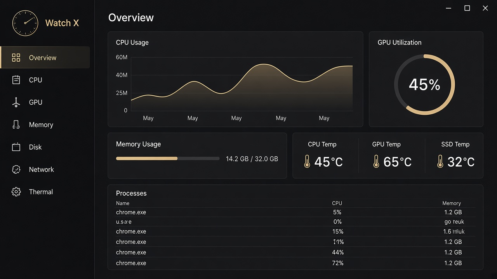

# Watch X

**Cross-platform desktop hardware monitor** for Windows, macOS, and Linux — CPU, GPU, memory (including Windows DDR5 SPD identity), temperatures, fans, disks, network, battery, and processes — with an always-on overlay HUD when you minimize the main window.

[](https://github.com/H0Andy/watch-x/releases)
[](LICENSE)
[](https://github.com/H0Andy/watch-x/releases)

[中文说明](README_CN.md) · [Download v1.0.0](https://github.com/H0Andy/watch-x/releases/tag/v1.0.0)



## Why Watch X?

Most “system monitors” either show SMBIOS marketing strings for RAM, invent DRAM die names, or force you online during install. Watch X focuses on **honest readings** and **offline Windows installs**:

- Prefer measured sources (SMBIOS, SPD, RAPL / Energy Meter) over guesswork
- Never invent DRAM die / IC part numbers when evidence is missing
- Windows installer ships **self-contained** helpers — no download mid-setup

## Features

- **Live dashboard** — CPU, discrete GPU, memory, thermals, fans, disk, network, battery, processes
- **Windows DDR5 SPD** — JEDEC / XMP / EXPO advertised profiles via elevated `spd-helper` + official PawnIO (bundled offline)
- **CPU package power** — Windows Energy Meter / RAPL when available
- **Overlay HUD** — keep key metrics visible after minimize / close-to-tray
- **Offline Windows packaging** — Electron + self-contained .NET helper + unmodified `PawnIO_setup.exe` inside Setup.exe

## Quick Start

### Download (recommended)

1. Open [Releases](https://github.com/H0Andy/watch-x/releases/latest)
2. Pick your platform:
   - **Windows**: `WatchX-*-Setup-x64.exe` (offline installer) or `*-Portable-x64.exe`
   - **macOS**: `WatchX-*-mac-arm64.dmg` (Apple Silicon) or `*-mac-x64.dmg` (Intel)
   - **Linux**: `.AppImage` or `.deb`
3. Install / run — no account required

### Develop from source

```bash
git clone https://github.com/H0Andy/watch-x.git
cd watch-x
npm install
npm run dev
```

Electron downloads slowly? Use a mirror (example):

```powershell
$env:ELECTRON_MIRROR="https://npmmirror.com/mirrors/electron/"
npm install
```

## Platforms

| OS | Installer | Notes |
| --- | --- | --- |
| Windows x64 | NSIS Setup + Portable | Bundles SPD helper + official PawnIO installer (silent local install) |
| macOS arm64 / x64 | DMG + ZIP | Unsigned local/test builds — Gatekeeper may need “Open Anyway” |
| Linux x64 | AppImage + deb | `chmod +x` for AppImage |

## Docs

- [Chinese README](README_CN.md)
- [Contributing](CONTRIBUTING.md)
- [Release notes](https://github.com/H0Andy/watch-x/releases)
- Packaging details (Windows offline): see [README_CN.md](README_CN.md#打包安装包) or scripts in `package.json`

## Honesty policy (hardware identity)

- SPD-advertised XMP/EXPO ≠ current runtime timings
- DRAM **die** stays unknown unless uniquely evidenced — never filled from marketing PN alone
- Missing sensors show an explicit unavailable state — no fake numbers

## License

[MIT](LICENSE)

## Links

- Repo: https://github.com/H0Andy/watch-x
- Latest release: https://github.com/H0Andy/watch-x/releases/latest
